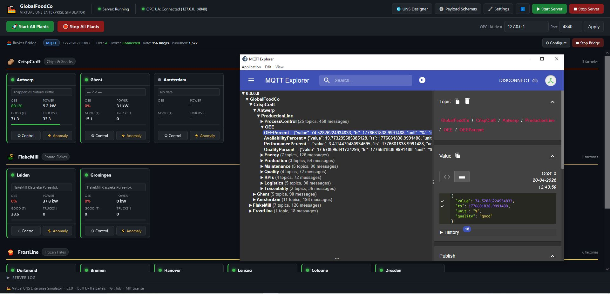
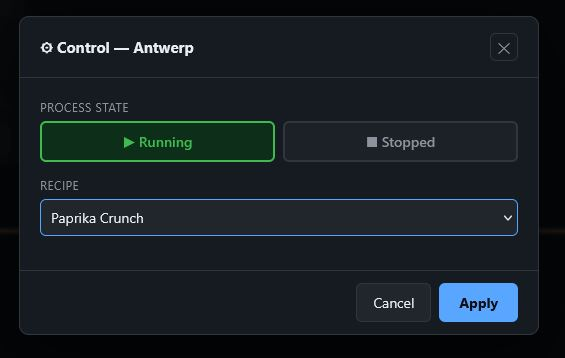
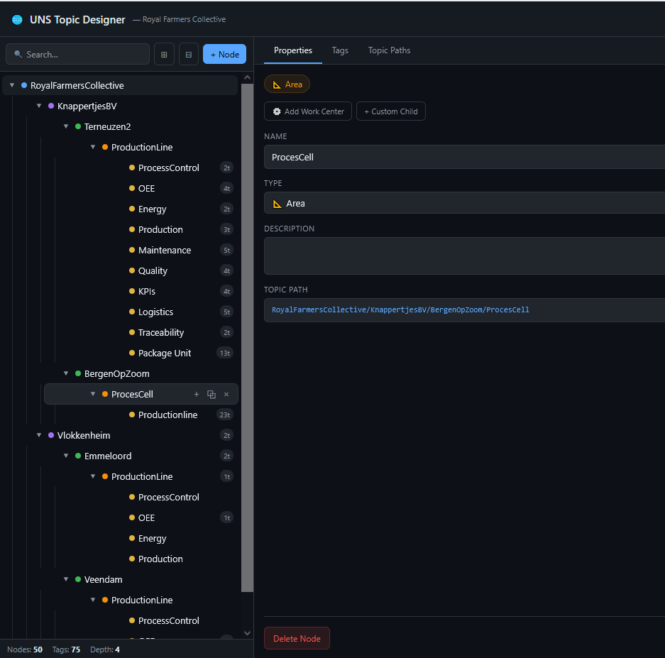
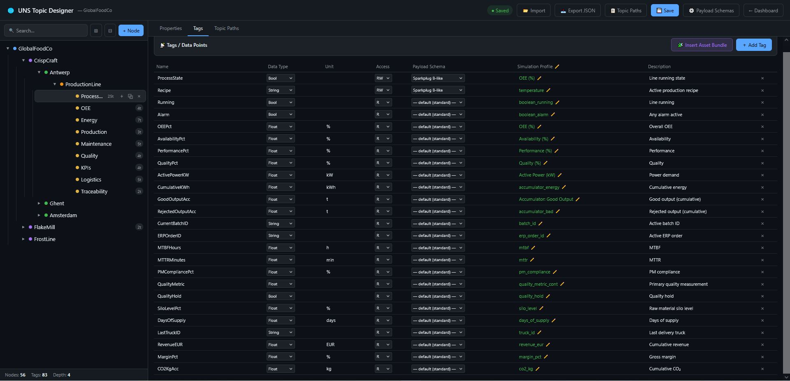
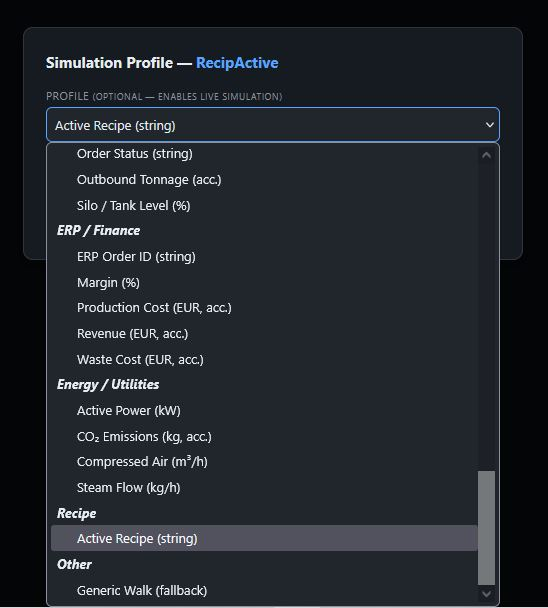
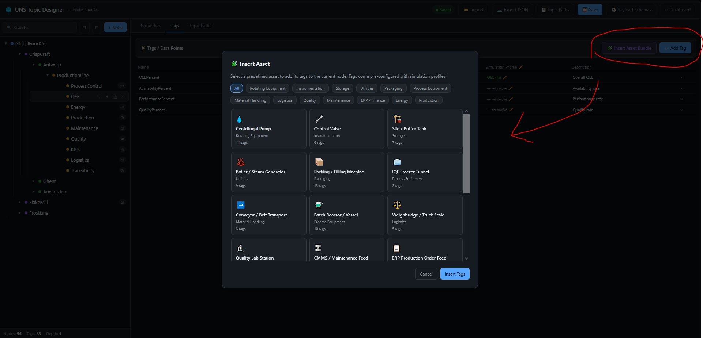
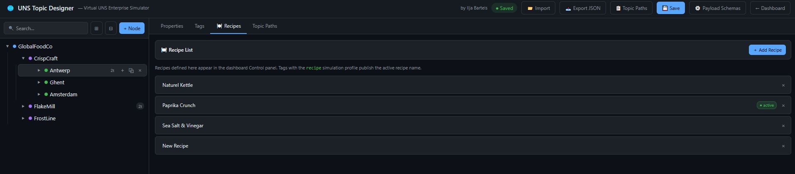
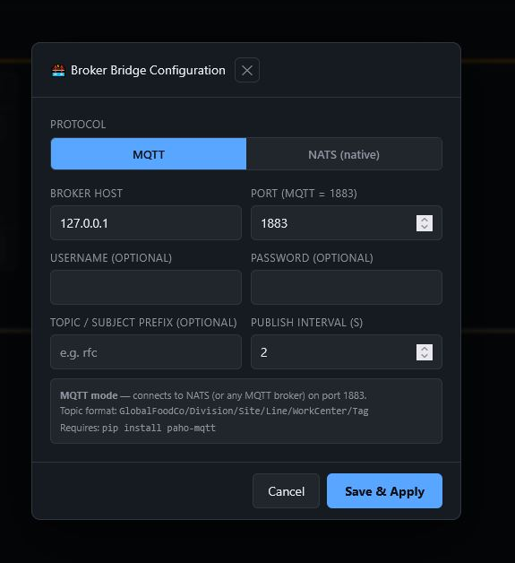

<div align="center">

# UNS Design Studio

**A fully self-contained Unified Namespace simulator for industrial IoT demos, training and development.**

[](FEATURES.md#release-notes)
[](LICENSE)
[](docker-compose.yml)
[](https://opcfoundation.org/)
[](https://mqtt.org/)
[](https://nats.io/)
[](https://github.com/Ilja0101)

*Simulate a complete multi-site food manufacturing enterprise — publishing realistic, stateful OT and IT data over OPC-UA, MQTT and NATS — without needing a single piece of real hardware.*

[Quick Start](#-quick-start) · [Features](#-features-at-a-glance) · [Pages](#-dashboard) · [Release Notes](#-release-notes) · [Full Docs](FEATURES.md)

</div>

---

## What is this?

The **UNS Design Studio** is a hands-on learning and demo environment for anyone working with **Unified Namespace (UNS)** architecture, **ISA-95 hierarchy**, **OPC-UA**, **MQTT/NATS** and **industrial data modelling**.

It ships with a fictional five-division food manufacturer — 13 factories across Europe — all producing coherent, realistic process data driven by a proper plant state machine. No random noise. No hardcoded tags. Everything is configurable through a visual browser-based designer.

**Built for:**
- Engineers learning UNS and ISA-95 concepts hands-on
- Teams evaluating MQTT brokers, NATS or time-series databases
- Demonstrating IIoT architecture to stakeholders without real equipment
- Testing Grafana dashboards, Telegraf pipelines or digital twin tooling

---

## Features at a Glance

| Feature | Description |
|---|---|
| **Stateful simulation** | Per-plant state machine: Running → Fault → Recovery → Stopped |
| **44 simulation profiles** | OEE, process variables, CMMS, quality, logistics, ERP, energy, recipes |
| **16-asset library** | Predefined asset bundles — drop onto any UNS node in one click |
| **UNS Topic Designer** | Visual ISA-95 hierarchy editor in the browser |
| **Recipe system** | Per-plant recipe lists — switching recipes shifts simulation parameters live |
| **MQTT + NATS bridge** | Configurable payload schemas, topic prefixes and publish intervals |
| **Payload Schema Designer** | Design your own message formats — Sparkplug B, ISA-95, PI, InfluxDB and more |
| **Live UNS Viewer** | Real-time namespace monitor via external broker + WebSocket |
| **Example templates** | Ready-to-import enterprise UNS JSON templates |
| **Docker-first** | Single `docker compose up` gets everything running |

> Full architecture, API reference, simulation profiles and configuration docs → **[FEATURES.md](FEATURES.md)**

---

## Prerequisites

### Option A — Docker (recommended)

| Requirement | Notes |
|---|---|
| [Docker Desktop](https://www.docker.com/products/docker-desktop/) | Includes Docker Compose. Windows, Mac or Linux. |
| Free ports | **5000** (dashboard), **4840** (OPC-UA), **9999** (anomaly TCP) |

No Python or other dependencies needed — everything runs inside the container.

### Option B — Local (Python)

| Requirement | Version | Notes |
|---|---|---|
| [Python](https://www.python.org/downloads/) | 3.10 or newer | Add to PATH during install |
| pip | bundled with Python | Used to install dependencies |
| Free ports | — | Same as above: 5000, 4840, 9999 |

Python dependencies installed automatically via `pip install -r requirements.txt`:

| Package | Purpose |
|---|---|
| `flask` ≥ 3.0 | Web dashboard and REST API |
| `opcua` ≥ 0.98 | OPC-UA server |
| `paho-mqtt` ≥ 2.0 | MQTT broker bridge |
| `nats-py` ≥ 2.3 | NATS native bridge |
| `inquirer` ≥ 3.1 | CLI prompts (optional client) |

### Optional — external broker

To publish data via MQTT or NATS you'll need a running broker. Any of these work:

- # Using Docker
| Broker | Quick start using Docker |
|---|---|
| [Mosquitto](https://mosquitto.org/) | `docker run -p 1883:1883 eclipse-mosquitto` |
| [EMQX](https://www.emqx.io/) | `docker run -p 1883:1883 emqx/emqx` |
| [HiveMQ CE](https://www.hivemq.com/hivemq/community-edition/) | `docker run -p 1883:1883 hivemq/hivemq-ce` |
| [NATS Server](https://nats.io/) | `docker run -p 4222:4222 -p 1883:1883 -p 8222:8222 -p 8088:8088 nats -js --mqtt_port 1883 -m 8222 --websocket_port 8088` |
| Any cloud MQTT broker | Set host/port/credentials in the bridge config |

- # Using Windows executables

| Broker | Quick start using Windows |
|---|---|
| [Mosquitto](https://mosquitto.org) | `winget install mosquitto` or run the [Installer](https://mosquitto.orgdownload/) |
| [EMQX](https://emqx.io) | Download `.zip` and run `.\bin\emqx start` |
| [HiveMQ CE](https://hivemq.com) | Download `.zip` and run `.\bin\run.bat` (Requires Java 11+) |
| [NATS Server](https://nats.io) | `nats-server.exe -js --mqtt_port 1883 -m 8222 --websocket_port 8088` |
| Any cloud MQTT broker | Connect via [MQTT Explorer](https://mqtt-explorer.com) or [NATS CLI](https://github.com) |


The OPC-UA server and dashboard work without a broker — you only need one if you want to publish data.

---

## Quick Start

### Option A — Docker

```bash
git clone https://github.com/Ilja0101/UNS-Design-Studio.git
cd UNS-Design-Studio
docker build -t uns-design-studio:latest .
docker compose up -d
```

### Option B — Local

```bash
pip install -r requirements.txt
start_dashboard.bat        # Windows
# or: bash start_dashboard.sh
```

Open **http://localhost:5000**, start the virtual plants and begin streaming data.

---

## Dashboard



The main dashboard gives you a live overview of every factory across all divisions. Each plant card shows running state, OEE, power draw, active recipe, good output and truck deliveries.

The **Broker Bridge** bar shows protocol, broker address, connection state and live publish rate. Click **Control** on any card to toggle the plant or switch its active recipe.



---

## UNS Topic Designer

Navigate to **http://localhost:5000/uns**



Visual ISA-95 hierarchy editor. Click any node to edit name, type and description — the full MQTT/NATS topic path updates live. Node types: Enterprise → Business Unit → Site → Area → Work Center → Work Unit → Device.

### Tags



Each tag carries a name, data type, unit, access level, payload schema and simulation profile. A production line node can hold dozens of tags covering OEE, energy, production, CMMS, quality, logistics and finance in a single view.

### Simulation Profiles



44 profiles grouped by domain — OT / Process, Accumulators, CMMS, Quality, Logistics, ERP, Energy, Recipe. Each profile shows a contextual hint when selected. See the [full profile list in FEATURES.md](FEATURES.md#simulation-profiles).

---

## Asset Library



Click **Insert Asset Bundle** to drop a fully pre-wired set of tags onto any node — simulation profiles, data types and units already configured. 16 assets available including pumps, valves, freezers, reactors, conveyors, quality labs and ERP feeds.

→ [Full asset list in FEATURES.md](FEATURES.md#asset-library)

---

## Recipe System



Recipes are configured per plant in the **Recipes** tab on any Site node. The active recipe is shown with a green **● active** badge. Switching recipes on the dashboard adjusts power draw, infeed rate, quality and availability targets live on the next tick — not just the label.

Any tag with the `recipe` profile publishes the active recipe name as a string to MQTT/NATS.

---

## Broker Bridge



Toggle between **MQTT** and **NATS native**, set broker host/port/credentials, topic prefix and publish interval. The topic format preview updates live as you type.

---

## Payload Schema Designer

Navigate to **http://localhost:5000/payload-schemas**


Design message formats with key-value mappings from source fields to output JSON keys. A live JSON preview shows exactly what each published message will look like. Built-in presets: Standard, Simple Value, Sparkplug B-like, ISA-95 Extended, OSIsoft PI-like, InfluxDB-like.

---

## Live UNS Viewer

Navigate to **http://localhost:5000/live**


Connects to any external MQTT broker and displays all incoming messages in a live, filterable topic tree. Useful for validating that published topics match your designed namespace structure.

---

## Example Enterprise

The simulator ships with **GlobalFoodCo** — rename it to anything in the UNS designer and all topic paths and dashboard labels update automatically.

| Division | Product | Factories |
|---|---|---|
| **CrispCraft** | Chips & Snacks | Antwerp, Ghent |
| **FlakeMill** | Potato Flakes | Leiden, Groningen |
| **FrostLine** | Frozen Frites | Dortmund, Bremen, Hanover, Leipzig, Cologne, Dresden |
| **RootCore** | Chicory & Inulin | Lille |
| **SugarWorks** | Sugar Beet & Sugar | Bruges, Liege |

Ready-to-import enterprise templates are in `example_UNS_jsons_to_import/`.

### Import Templates

| File | Industry | Description |
|---|---|---|
| `Atomcraft_Energy_Nuclear_PWR.json` | Nuclear Energy | Twin-unit PWR station with reactor core, turbine hall, spent-fuel pool, safety system and capacity-factor KPIs |
| `Cleanflow_Water_Treatment.json` | Water & Utilities | Municipal drinking water treatment (coagulation → UV → chlorination) and activated-sludge wastewater plant |
| `Frostbite_Fantasy_Foods.json` | Frozen Food | IQF spiral freezer, blanching, VFFS packaging, cold store and cold-chain compliance KPIs |
| `Pillcraft_Co_Pharma.json` | Pharmaceuticals (GMP) | API synthesis, high-shear granulation, tablet compression, ISO 8 cleanroom packaging, LIMS lot-release data |
| `VaultChem_Industries_Fallout.json` | Pharma / Chem (Parody) | Fallout-universe parody — StimPak biomed-gel, RadAway IV bags, Nuka-Cola Quantum bottling, Jet & Buffout R&D vault |
| `Policy_Food_Processing.json` | Food Processing | Topic Policy v1.2 reference — fryer line, packaging, steam utilities with `_kpi`, `_energy`, `_maint`, `_mes` functional branches |
| `Policy_Process_Manufacturing.json` | Process Manufacturing | Topic Policy v1.2 reference — extraction, spray drying, evaporation with `_lims`, `_quality`, `_kpi`, `_maint` functional branches |
| `Walker_Reynolds_Clean_UNS.json` | Discrete / Mixed | Walker Reynolds "clean UNS" approach — flat physical hierarchy, no functional branches, simple self-describing tag names |

> All company names, divisions and locations are entirely fictional.

---

## Project Structure

```
UNS-Design-Studio/
├── app.py                # Flask web app + REST API
├── factory.py            # OPC-UA server + stateful simulation engine
├── bridge.py             # OPC-UA → MQTT / NATS bridge
│
├── uns_config.json       # ISA-95 namespace definition (editable via UI)
├── sim_state.json        # Runtime plant state, active recipes and recipe lists
├── asset_library.json    # Predefined asset tag bundles
├── payload_schemas.json  # MQTT/NATS payload format definitions
├── bridge_config.json    # Bridge connection settings
├── server_config.json    # OPC-UA server endpoint configuration
│
├── templates/
│   ├── index.html            # Main dashboard
│   ├── uns_editor.html       # UNS Topic Designer
│   ├── payload_schemas.html  # Payload Schema Designer
│   └── uns_live.html         # Live UNS Viewer
│
├── example_UNS_jsons_to_import/   # Example enterprise templates
├── docs/                          # Screenshots
├── Dockerfile
├── docker-compose.yml
├── entrypoint.sh         # First-boot config seeding + symlinks
└── requirements.txt
```

→ [Full configuration reference and API docs in FEATURES.md](FEATURES.md#configuration-reference)

---

## Release Notes

### v3.1 — Live UNS Viewer & Reference Templates *(current)*
- **Live UNS Viewer** — new page at `/live` for real-time namespace monitoring via external MQTT broker + WebSocket
- **Example enterprise templates** — importable JSON files in `example_UNS_jsons_to_import/`
- **FEATURES.md** — detailed architecture, requirements, API reference and simulation profile documentation added
- **UNS designer improvements** — updated layout and tag management


### v3.0 — Stateful Profile Engine
- **Complete rewrite of the simulation engine** — coherent per-plant state machine replacing independent random walks
- **44 simulation profiles** — all plant-state-aware, spanning OT, CMMS, quality, logistics, ERP, energy and recipes
- **Recipe system** — per-plant recipe lists in `sim_state.json`; switching recipes adjusts simulation parameters live
- **`recipe` simulation profile** — any tag assigned this profile publishes the active recipe name as a string
- **16-asset library** — predefined bundles insertable from the UNS designer in one click
- **Dynamic enterprise name** — dashboard reads UNS tree root name live
- **Grouped simulation profile picker** with contextual hints per profile
- **Recipes tab** in the UNS designer on Site nodes
- **OEE always `A × P × Q / 10000`** — never independently randomised
- **Accumulators gate on plant state** — pause during fault and stop

### v2.0 — Dynamic Address Space
- `uns_config.json`-driven OPC-UA address space — no hardcoded tag names
- Visual UNS Topic Designer with full ISA-95 node type support
- Payload Schema Designer with Standard, Sparkplug B-like, ISA-95, PI-like and InfluxDB-like presets
- NATS native mode in the bridge
- Anomaly injection via TCP socket

### v1.0 — Initial Release
- OPC-UA server with static address space
- MQTT bridge with configurable polling interval
- Flask dashboard with factory status overview
- Basic Gaussian walk simulation
- Docker support

---

## Contributing

1. Fork the repo and create a feature branch: `git checkout -b feature/my-improvement`
2. Commit your changes: `git commit -m 'Add XYZ'`
3. Push and open a pull request

**Adding a simulation profile:** add to `_profile_value()` in `factory.py` and the `SIMULATION_PROFILES` dict in `app.py`.

**Adding an asset template:** add an entry to `asset_library.json` — it appears in the picker immediately on next page load.

---

## 📄 License

MIT — see [LICENSE](LICENSE) for details.

---

<div align="center">

*GlobalFoodCo and all associated divisions, factories and products are entirely fictional.*<br>
*Built with ☕ to make UNS concepts tangible for engineers who learn by doing.*<br><br>
**[⭐ Star on GitHub](https://github.com/Ilja0101/UNS-Design-Studio)** · **[👤 Ilja Bartels](https://github.com/Ilja0101)**

[](https://ko-fi.com/F1F11Y5F5R)

</div>
