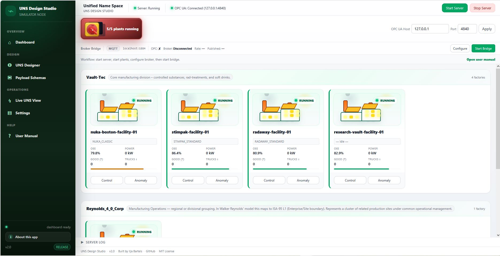
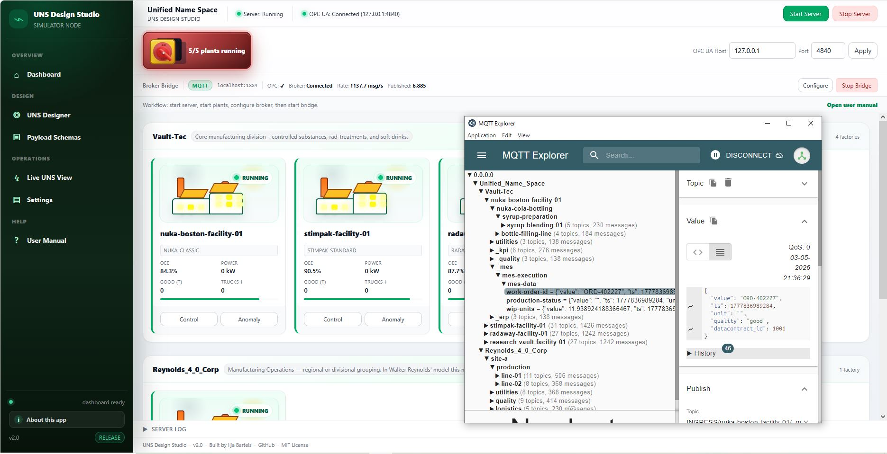
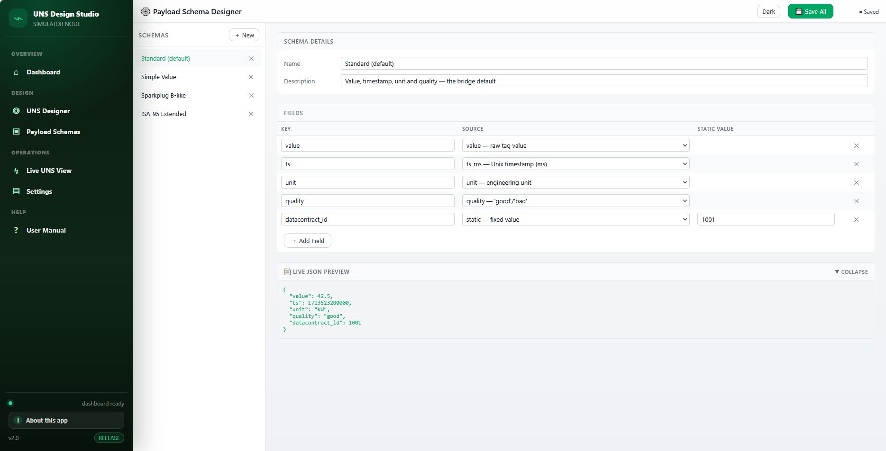

<div align="center">

# UNS Design Studio V2.0

**A self-contained Unified Namespace simulator for industrial IoT demos, training, and development.**

[](FEATURES.md)
[](LICENSE)
[](portainer-stack.yml)
[](https://opcfoundation.org/)
[](https://mqtt.org/)

[What is this?](#what-is-this) · [Devcontainer](#devcontainer-recommended) · [Quick start](#quick-start-local) · [Docker](#docker) · [Ports](#ports) · [Full docs](FEATURES.md)

</div>

---

## What is this?

UNS Design Studio lets you model an industrial enterprise, generate realistic plant data, and publish it through common OT/IIoT protocols — without connecting to real machines. Use it to prototype Unified Namespace designs, teach ISA-95 concepts, test MQTT/NATS pipelines, validate OPC-UA clients, and demo industrial dashboards with configurable sites, assets, recipes, tags, payloads, and faults.

## Demo


[](docs/v2/UNS%20Design%20Studio%20v2.mp4)

| UNS Designer | MQTT Dashboard | Payload Designer |
|---|---|---|
|  |  |  |

## Features

- Browser dashboard for virtual plant control, recipes, metrics, anomaly injection, and process supervision.
- Visual ISA-95 / UNS tree designer backed by `uns_config.json`.
- Dynamic OPC-UA server generated from the configured UNS.
- OPC-UA → MQTT/NATS bridge with configurable broker, topic prefix, interval, and payload schemas.
- Live UNS viewer for real-time topic inspection in the browser.
- Built-in Mosquitto MQTT broker and MQTT Explorer — no external broker needed.
- Asset library, importable enterprise templates, and configurable simulation profiles.

---

## Devcontainer (recommended)

The easiest way to run UNS Design Studio is with the included devcontainer. It automatically provisions the full environment — including an MQTT broker and MQTT Explorer — with zero manual setup.

### Prerequisites

- [VS Code](https://code.visualstudio.com/) with the [Dev Containers extension](https://marketplace.visualstudio.com/items?itemName=ms-vscode-remote.remote-containers), **or**
- [GitHub Codespaces](https://github.com/features/codespaces)

### Start

1. Open this repository in VS Code and click **Reopen in Container** when prompted, or open it directly as a Codespace.
2. Wait for the container to build and the `postStartCommand` to finish (~1 minute on first run).
3. Start the dashboard:
   ```bash
   python app.py
   ```
4. Open the forwarded port **5000** in your browser.

### What the devcontainer includes

The devcontainer automatically starts two Docker containers alongside the dev environment:

| Container | Port | Description |
|---|---|---|
| `mosquitto` | 1883 (TCP), 8083 (WebSocket) | Eclipse Mosquitto MQTT broker |
| `mqtt-explorer` | 4000 | MQTT Explorer web UI |

Both containers are on the `uns-net` Docker network and can address each other by container name.

### Using the dashboard

Once `python app.py` is running:

1. Open **port 5000** — the main dashboard.
2. Click **Start Server** to start the OPC-UA simulation server.
3. Click **Start All Plants** to begin the simulation.
4. Click **Start Bridge** to start publishing OPC-UA data to MQTT.

The bridge builds a node cache on first start (~5 seconds), then begins publishing all UNS tags to Mosquitto at ~1 second intervals.

### UNS Live View

The **UNS Live View** (sidebar → Live View) shows the real-time topic tree from the MQTT broker directly in the browser.

- The connection settings auto-detect the correct WebSocket URL for your environment.
- If you previously used the live view with different settings, clear `uns-live-settings` from your browser's **LocalStorage** (DevTools → Application → Local Storage) and reload the page.
- Click **Connect** — you should immediately see the topic tree populate with live values.

The live view connects through the dashboard's built-in `/mqtt-ws` proxy, so it uses the same host and port as the dashboard itself. No separate broker port needed.

### MQTT Explorer

MQTT Explorer is a full-featured MQTT client pre-configured to connect to the local Mosquitto broker.

1. Open **port 4000** in your browser.
2. Select the **UNS Design Studio** connection (pre-configured).
3. Click **Connect**.

You will see the full UNS topic tree with live values, charts, and message history.

### Bridge broker settings

The MQTT bridge (`bridge.py`) runs on the host, not inside Docker. It connects to the broker at `localhost:1883`.

> Do not change the broker host to `mosquitto` in the Settings page — that hostname only resolves inside Docker containers. The Python bridge uses `localhost`.

MQTT Explorer and the UNS Live View connect through Docker, so they use `mosquitto:1883` (Explorer) and the `/mqtt-ws` proxy (live view) respectively.

---

## Quick start (local)

Requires Python 3.10+ and Docker (for the MQTT broker).

```bash
pip install -r requirements.txt
# Start Mosquitto broker
docker run -d --name mosquitto -p 1883:1883 -p 8083:8083 \
  -v "$(pwd)/.devcontainer/mosquitto.conf:/mosquitto/config/mosquitto.conf:ro" \
  eclipse-mosquitto:2
# Start the dashboard
python app.py
```

Open `http://localhost:5000`. Use the UI to start the OPC-UA server, plants, and bridge.

Optional launch scripts:

```bat
start_dashboard.bat
```

```bash
bash start_dashboard.sh
```

---

## Ports

| Port | Service | Notes |
|---|---|---|
| 5000 | Dashboard | Main web UI |
| 4840 | OPC-UA | Started on demand from the dashboard |
| 9999 | Anomaly TCP | Inject anomalies via TCP |
| 1883 | MQTT (TCP) | Mosquitto broker |
| 8083 | MQTT (WebSocket) | Mosquitto broker WebSocket listener |
| 4000 | MQTT Explorer | Browser-based MQTT client |

---

## Docker

```bash
docker compose up -d --build
docker compose logs -f
```

The local Compose build tags the image as `uns-design-studio:2.0`. Runtime state is stored in the `uns-design-studio-data` Docker volume.

## Portainer / GHCR

Use `portainer-stack.yml` to deploy the published image from GitHub Container Registry:

```text
ghcr.io/ilja0101/uns-design-studio:2.0
```

In Portainer, paste the stack file and optionally set:

```text
UNS_IMAGE=ghcr.io/ilja0101/uns-design-studio:2.0
```

---

## Runtime files

Root JSON files are live mutable state, not fixtures:

`uns_config.json`, `sim_state.json`, `bridge_config.json`, `server_config.json`, `payload_schemas.json`, `asset_library.json`

Docker seeds these into `/data` on first boot and symlinks `/app/*.json` to `/data/*.json`.

## Validation

```bash
python -m py_compile app.py factory.py bridge.py
docker compose config
python -m pytest
```

---

## License

MIT — see [LICENSE](LICENSE).

<div align="center">

Built by [Ilja Bartels](https://github.com/Ilja0101), [Alex Hodakovsky](https://github.com/morphal) & [Jorgen van D.](https://github.com/jodur)  for practical UNS and industrial IoT learning.

</div>
