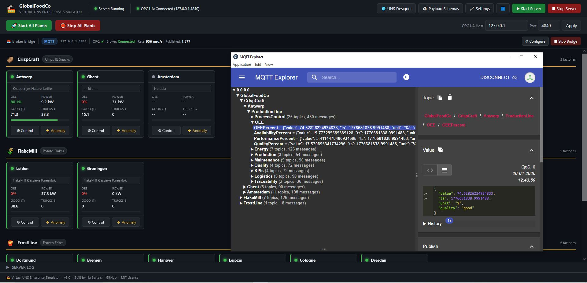
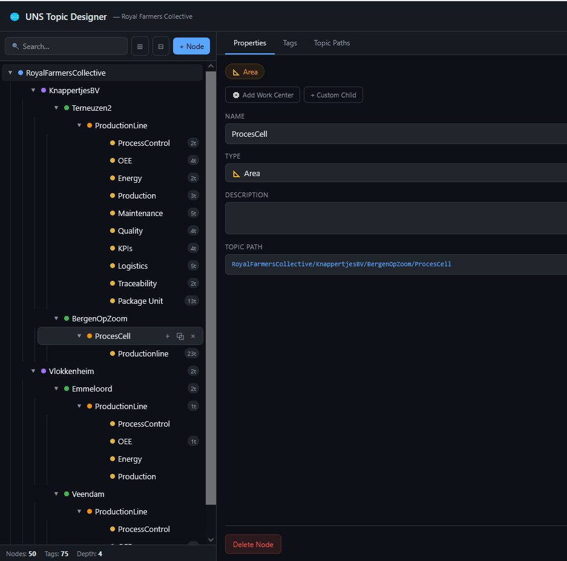
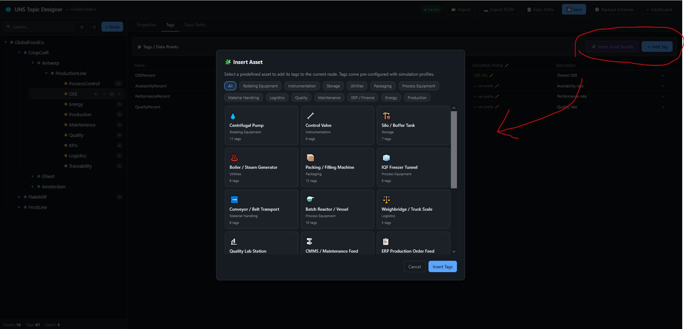
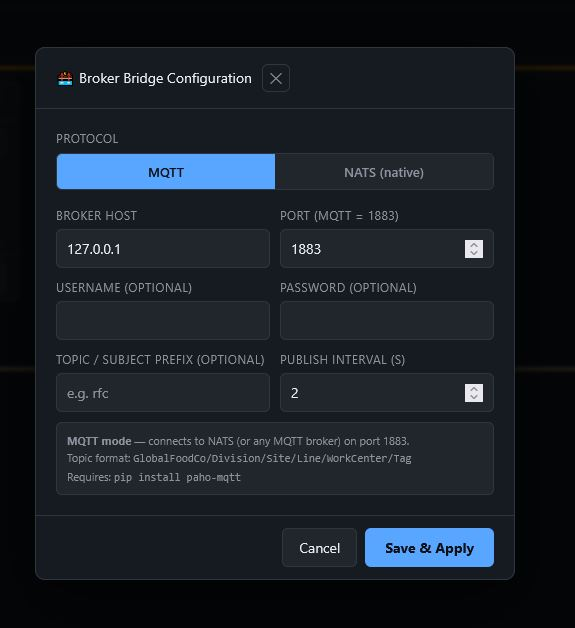

<div align="center">

# UNS Design Studio V2.0

**A self-contained Unified Namespace simulator for industrial IoT demos, training, and development.**

[](FEATURES.md#release-notes)
[](LICENSE)
[](portainer-stack.yml)
[](https://opcfoundation.org/)
[](https://mqtt.org/)
[](https://nats.io/)

Simulate a complete industrial enterprise that publishes realistic, configurable OT and IT data over OPC-UA, MQTT, and NATS without real hardware.

[Quick Start](#quick-start) · [Docker](#docker) · [Portainer](#portainer-stack) · [Configuration](#configuration-and-state) · [Release Notes](#release-notes)

</div>

---

## V2.0 overview

UNS Design Studio is a browser-based lab for learning and demonstrating Unified Namespace architecture, ISA-95 modelling, OPC-UA address spaces, broker publishing, and industrial payload design.

V2.0 focuses on a dynamic, configurable simulator:

- Visual UNS tree designer backed by `uns_config.json`
- Dynamic OPC-UA address-space generation from the configured UNS
- Stateful plant simulation with running, fault, recovery, and stopped states
- Per-site recipes and plant controls persisted in `sim_state.json`
- OPC-UA to MQTT/NATS bridge with configurable broker settings
- Payload Schema Designer for custom JSON message formats
- Live UNS Viewer for broker-side validation
- Importable example enterprise templates in `example_UNS_jsons_to_import/`
- Docker, Portainer, and GHCR-ready deployment assets

Full technical details remain in [FEATURES.md](FEATURES.md).

---

## Screenshots

Existing release screenshots are stored under `docs/` and referenced directly by this README.

| Dashboard | UNS Designer |
|---|---|
|  |  |

| Asset Library | Payload Designer |
|---|---|
|  |  |

| Broker Bridge | Live UNS Viewer |
|---|---|
|  |  |

---

## Quick Start

### Local Python

Requirements:

- Python 3.10 or newer
- Free ports: 5000 for the dashboard, 4840 for OPC-UA, and 9999 for anomaly TCP

```bash
pip install -r requirements.txt
python app.py
```

On Windows you can also run:

```bat
start_dashboard.bat
```

On Linux/macOS:

```bash
bash start_dashboard.sh
```

Open `http://localhost:5000`, start the virtual plants, and configure broker publishing from the dashboard.

---

## Docker

The local Compose file preserves build convenience and tags the locally built image as `uns-design-studio:2.0` by default. Override `UNS_LOCAL_IMAGE` only when you want Compose to tag/test a different local or registry image.

```bash
docker compose up -d --build
docker compose logs -f
```

Dashboard: `http://localhost:5000`

OPC-UA endpoint: `opc.tcp://localhost:4840`

Anomaly TCP: `localhost:9999`

Runtime JSON state is persisted in the `uns-design-studio-data` named volume and surfaced in the container at `/data`.

---

## Portainer stack

Use `portainer-stack.yml` when deploying from Portainer or another host that should pull from GitHub Container Registry.

Default image:

```text
ghcr.io/ilja0101/uns-design-studio:2.0
```

Optional override:

```text
UNS_IMAGE=ghcr.io/ilja0101/uns-design-studio:2.0
```

Deploy the stack with the contents of `portainer-stack.yml`. It exposes the same ports and persists runtime state in the `uns-design-studio-data` volume. Portainer users can paste the stack file directly and define `UNS_IMAGE` as an environment variable if they prefer `latest`, `v2.0`, a future semver tag, or an immutable `sha-*` image tag.

---

## Main pages

| Page | URL | Purpose |
|---|---|---|
| Dashboard | `/` | Start/stop plants, view metrics, configure OPC/network and bridge controls |
| UNS Designer | `/uns` | Edit ISA-95 hierarchy, tags, simulation profiles, recipes, and imports |
| Payload Schemas | `/payload-schemas` | Build JSON payload templates for MQTT/NATS messages |
| Live UNS Viewer | `/live` | Subscribe to a broker and inspect live published topics |
| Settings | `/settings` | Operational settings page |
| Manual | `/manual` | In-app user guidance |

---

## Configuration and state

The root JSON files are authoritative mutable state, not static fixtures. Keep these filenames unchanged unless every app, Docker, and documentation reference is updated.

| File | Role |
|---|---|
| `uns_config.json` | ISA-95 UNS tree, tag definitions, recipes, and namespace metadata |
| `sim_state.json` | Runtime plant running state and active recipe selections |
| `bridge_config.json` | MQTT/NATS bridge protocol, host, credentials, topic prefix, and interval |
| `server_config.json` | OPC-UA bind/client network settings and anomaly TCP port |
| `payload_schemas.json` | Payload schema presets and user-defined schemas |
| `asset_library.json` | Reusable asset/tag bundles for the UNS designer |

In Docker, `entrypoint.sh` seeds these files into `/data` on first boot and symlinks `/app/*.json` back to `/data/*.json` so local paths remain compatible with the app code.

Important identity rule: plant keys use `BusinessUnit|SiteName` with bare site names, while OPC-UA site nodes are named `Factory{SiteName}`.

---

## Broker usage

The simulator can run without an external broker if you only need the dashboard and OPC-UA server. To publish MQTT or NATS data, start a broker and configure it in the dashboard bridge modal.

Examples:

```bash
docker run -p 1883:1883 eclipse-mosquitto
```

```bash
docker run -p 4222:4222 -p 1883:1883 -p 8222:8222 nats -js --mqtt_port 1883 -m 8222
```

The bridge emits stdout lines prefixed with `[BRIDGE_STATS]` for live dashboard statistics.

---

## Validation

Current repository validation commands:

```bash
python -m py_compile app.py factory.py bridge.py
docker compose config
docker compose -f portainer-stack.yml config
python -m pytest
```

The GitHub Actions Python workflow also compiles the Python entrypoints and runs the existing unit tests.

---

## Docker image publishing

`.github/workflows/docker-ghcr.yml` builds with Docker Buildx for `linux/amd64` and `linux/arm64` and publishes to GitHub Container Registry on main branch pushes, semver/version tags, GitHub releases, and manual dispatches. Pull requests build without publishing.

Expected GHCR image namespace:

```text
ghcr.io/ilja0101/uns-design-studio
```

Release-oriented tags include `latest` for `main`, `2.0` and `v2.0` for the V2.0 release path, semver tag-derived values from version tags, branch tags, and `sha-*` tags. Manual dispatch can refresh the `2.0` / `v2.0` tags or run without those aliases.

Recommended V2.0 release sequence:

```bash
git push origin main
git tag v2.0
git push origin v2.0
```

After the workflow publishes, deploy the explicit V2.0 image with:

```bash
docker pull ghcr.io/ilja0101/uns-design-studio:2.0
UNS_IMAGE=ghcr.io/ilja0101/uns-design-studio:2.0 docker compose -f portainer-stack.yml up -d
```

---

## Release Notes

### V2.0 — Repository cleanup and release preparation *(current)*

- Updated app-visible version strings to V2.0 / 2.0
- Refreshed GitHub-ready README with deployment, state, validation, and release notes
- Aligned local Compose image naming with `uns-design-studio:2.0`
- Kept Portainer stack aligned to the GHCR V2.0 image with an `UNS_IMAGE` override
- Added GHCR Docker publishing workflow suitable for main, semver tags, releases, pull requests, and manual dispatch
- Removed obsolete V2 roadmap planning document after release preparation

### V2.0 — Dynamic Address Space

- `uns_config.json`-driven OPC-UA address space with no hardcoded tag names
- Visual UNS Topic Designer with ISA-95 node type support
- Payload Schema Designer with Standard, Sparkplug B-like, ISA-95, PI-like, and InfluxDB-like presets
- MQTT and NATS publishing bridge
- Anomaly injection over TCP

### V1.0 — Initial Release

- OPC-UA server with static address space
- MQTT bridge with configurable polling interval
- Flask dashboard with factory status overview
- Basic Gaussian walk simulation
- Docker support

---

## Project structure

```text
UNS-Design-Studio/
├── app.py                         # Flask app, REST API, process supervisor
├── factory.py                     # OPC-UA server and simulation engine
├── bridge.py                      # OPC-UA to MQTT/NATS bridge
├── json_persistence.py            # Atomic JSON persistence helpers
├── sim_state_service.py           # Simulation state merge/sync helpers
├── uns_tree.py                    # UNS traversal utilities
├── templates/                     # Browser pages
├── static/                        # CSS and JavaScript assets
├── docs/                          # Screenshots and documentation assets
├── example_UNS_jsons_to_import/   # Importable UNS examples
├── tests/                         # Lightweight unit tests
├── Dockerfile
├── docker-compose.yml
├── portainer-stack.yml
└── entrypoint.sh
```

---

## License

MIT — see [LICENSE](LICENSE).

<div align="center">

Built by [Ilja Bartels](https://github.com/Ilja0101) for practical UNS and industrial IoT learning.

</div>
